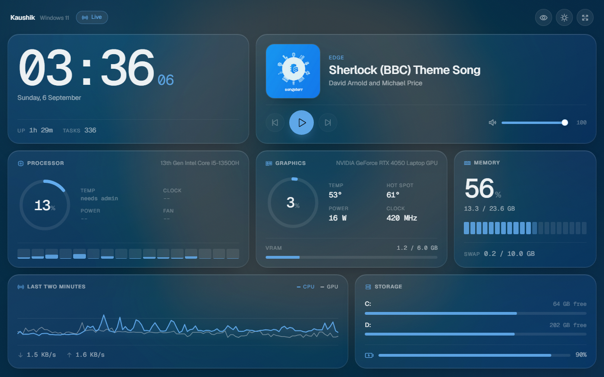
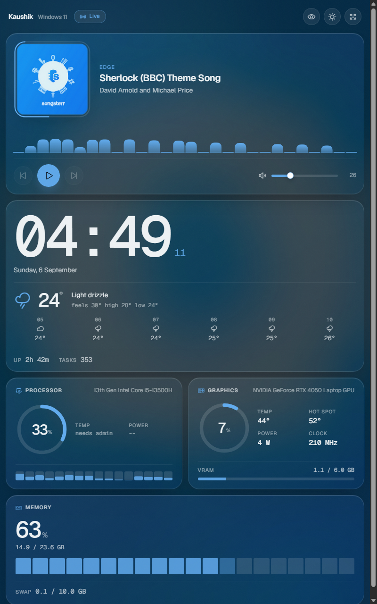
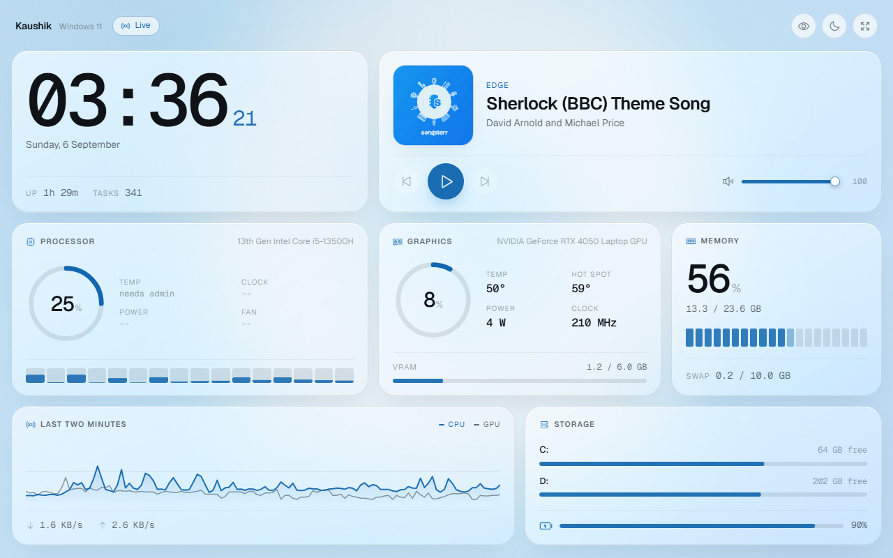

# Slate

A local dashboard for your PC, built to live on a spare tablet. A big clock
with the local forecast, a player for whatever is currently playing with a
spectrum analyser that follows the actual audio coming out of the machine, and
a strip of instruments for CPU, GPU and memory.

Everything runs on your machine. The only outbound request is to a weather
API. There is no account, and the tablet only needs to be on the same
network.



<details>
<summary>Portrait and light mode</summary>




</details>

## Running it

Double-click **`run.bat`**. The first run creates a virtual environment and
installs dependencies, which takes a minute; after that it starts immediately.

The console prints the address to open on the tablet:

```
  Slate is running.
    tablet:  http://192.168.1.24:8750
    here:    http://localhost:8750
```

Open that address in the tablet's browser. On iPad use Share -> Add to Home
Screen, and on Android use the browser menu -> Add to Home screen, to get a
full-screen icon with no address bar.

### CPU temperature needs admin

Reading CPU package temperature, per-core clocks and fan speeds requires a
kernel driver that only an elevated process can load. Without it you still get
CPU load, GPU temperature, memory, storage and everything else.

To get the full set, start **`run-admin.bat`** instead. Slate says so in the UI
rather than showing a dash you cannot explain.

### Letting the tablet through the firewall

Windows blocks inbound connections by default, and the allow-rule it may have
created for Python will not cover this app: the server runs from the project's
own `.venv\Scripts\python.exe`, which Windows treats as a different program.

Add one rule, once, in an **elevated** PowerShell. It opens only this port and
only to devices on the same network, never the wider internet:

```powershell
New-NetFirewallRule -DisplayName "Slate dashboard (LAN)" -Direction Inbound `
  -Action Allow -Protocol TCP -LocalPort 8750 -Profile Any `
  -RemoteAddress LocalSubnet
```

`-Profile Any` is deliberate. Windows often classifies a phone hotspot or a
shared network as **Public**, so a rule scoped to Private silently does nothing.

To remove it later:

```powershell
Remove-NetFirewallRule -DisplayName "Slate dashboard (LAN)"
```

### When the tablet cannot connect

Check these in order. The log (below) tells you which one you are in.

1. **Nothing in the log at all.** The request is not reaching the machine.
   Confirm the PC still holds the address you typed:

   ```powershell
   Get-NetIPAddress -InterfaceAlias "Wi-Fi" -AddressFamily IPv4 |
     Select-Object IPAddress,SuffixOrigin
   ```

   An address starting `169.254.` means the Wi-Fi lost its DHCP lease and the
   PC has no working address, whatever the signal strength says. Renew it:

   ```powershell
   ipconfig /renew "Wi-Fi"
   ```

   `SuffixOrigin` should read `Dhcp`, not `Link`. Note that the address can
   change when you rejoin a network, so re-read it from the console banner.

2. **Requests in the log but the page looks wrong.** Reload with the cache
   cleared; the tablet may be holding an old copy.

3. **The address is right and the log stays empty.** Either the firewall rule
   above is missing, or the network has client isolation turned on, which is
   common on guest and hotspot networks. Isolation cannot be fixed from the PC.

## Connection log

Every request and websocket is written to `logs/slate.log`, and to the console
window, one file per day with a fortnight kept:

```
2026-09-06 03:54:43  new device on the network: 172.30.212.170  (Android 10 / Chrome)
2026-09-06 03:54:43  172.30.212.170  GET / -> 200  33 ms
2026-09-06 03:54:43  172.30.212.170  websocket open   (1 watching)
2026-09-06 03:54:52  172.30.212.170  websocket closed (WebSocketDisconnect after 9s, 0 watching)
```

Each address is named once, on first sight, with the device it looks like, so
the log reads as a guest list rather than a wall of requests. Static assets are
filtered out; set `SLATE_LOG_ASSETS=1` to include them.

`http://localhost:8750/api/clients` returns the same thing as JSON: who is
watching right now and every device seen since the server started.

## On the tablet

- **Eye button** holds the screen awake so the dashboard does not sleep. The
  setting is remembered.
- **Sun / moon** switches between light and dark. It follows the tablet's own
  setting until you pick one.
- **Arrows** go full screen.
- Tap the CPU temperature reading to see why it is unavailable.

The accent colour is sampled from the current album art, and the background is
that artwork blurred behind the glass, so the whole dashboard shifts with what
you are listening to. When nothing is playing it settles back to mint.

## The spectrum

The bars under the player follow the machine's actual audio output, tapped
from the WASAPI loopback of the default device. It works for anything audible,
not only apps with a media session, and it follows you if you change output
device mid-song - to an interface, to Bluetooth, and back - usually within a
couple of seconds, without restarting the server.

Following the default is done through Windows Core Audio (`pycaw`), not
PortAudio: PortAudio only learns the default device once, when it starts up,
so asking it later just replays that first answer. A separate check reads the
live default straight from Core Audio and reopens the tap when it disagrees.
Band edges are recomputed on every reopen, so a switch between devices running
at different sample rates (a 96kHz interface, 48kHz Bluetooth) still maps
frequencies correctly.

Set `SLATE_AUDIO_DEVICE` to a case-insensitive substring of a device name
(e.g. `SLATE_AUDIO_DEVICE=esi`) to pin capture to that device and stop
following the default.

Only band magnitudes ever leave the analyser. Audio is measured in a rolling
in-memory window and discarded; nothing is recorded and nothing is written to
disk. If no loopback device is available, or a pinned name matches nothing,
the bars simply never appear, and the startup banner and `/api/state` say why.

Frames are only sent while there is sound and a browser attached, so a silent
machine costs nothing.

## The backdrop

Panels are frosted glass, which needs something behind it or it reads as flat
grey. By default that something is the current album art, blurred.

With nothing playing, it falls back to whatever you drop into `web/ambient`:
an `.mp4`, `.webm` or `.gif` becomes a looping backdrop the glass refracts
over. Several files rotate every six minutes. See `web/ambient/README.txt` for
the details and the two CSS knobs that control how strongly it reads.

## The weather

Open-Meteo, which needs no API key and no account. It is set to Noida; change
`SLATE_LAT`, `SLATE_LON` and `SLATE_PLACE` to move it. The forecast refreshes
every ten minutes, and the hourly strip uses the timezone the API reports for
those coordinates, so it lines up with the clock beside it.

## What it reads, and how

| Reading | Source |
| --- | --- |
| CPU load, per-core load, memory | `psutil` |
| CPU temperature and package power | LibreHardwareMonitor (admin) |
| GPU load, temperature, hot spot, VRAM, power, clock | LibreHardwareMonitor, falling back to `nvidia-smi` |
| Now playing, transport, seek | Windows `GlobalSystemMediaTransportControls` |
| Volume and mute | Windows Core Audio |
| Audio spectrum | WASAPI loopback of the default output |
| Weather | [Open-Meteo](https://open-meteo.com), no key required |

Because the media bridge is the same one behind the Windows volume overlay, it
works with Spotify, browser tabs, VLC, foobar2000 and anything else that
registers a media session. No per-app integration.

## Configuration

Environment variables, all optional:

| Variable | Default | Meaning |
| --- | --- | --- |
| `SLATE_PORT` | `8750` | Port to serve on |
| `SLATE_HOST` | `0.0.0.0` | Interface to bind; use `127.0.0.1` to keep it local-only |
| `SLATE_INTERVAL` | `1.0` | Seconds between samples |
| `SLATE_LAT` | `28.5355` | Latitude for the forecast |
| `SLATE_LON` | `77.3910` | Longitude for the forecast |
| `SLATE_PLACE` | `Noida` | Name shown beside the forecast |
| `SLATE_LOG_LEVEL` | `INFO` | Set to `WARNING` to quieten the log |
| `SLATE_LOG_ASSETS` | unset | Set to `1` to log CSS, JS and font requests too |
| `SLATE_AUDIO_DEVICE` | unset | Pin the spectrum to a device by name substring, instead of following the default |

To start Slate when you log in: press `Win+R`, run `shell:startup`, and put a
shortcut to `run.bat` (or `run-admin.bat`) in the folder that opens.

## Layout

```
slate/
  server/
    main.py        FastAPI app, websocket push loop, media endpoints
    hardware.py    sensor sampling, layered across LHM / nvidia-smi / psutil
    media.py       Windows media session bridge and system volume
    audio.py       WASAPI loopback capture and FFT banding
    weather.py     Open-Meteo forecast, cached
    access.py      connection logging
  web/
    index.html     the dashboard
    ambient/       drop a looping clip here, see the README inside
    css/style.css  glass, layout, both themes
    js/app.js      websocket client, dials, chart, controls
    vendor/        Geist, Geist Mono, Phosphor icons (self-hosted)
  vendor/lhm/      LibreHardwareMonitor assemblies
  tools/
    fetch_vendor.py  re-downloads everything under vendor/
  logs/
    slate.log        who connected, rotated daily
```

Fonts and icons are served from your own machine rather than a CDN, so the
dashboard looks right on a tablet with no internet access.

## Notes

- The sampler idles when no browser is connected. Measured on a 13th-gen i5:
  0.2% of one core sitting idle, 2.9% of one core while streaming to a tablet
  once a second.
- The graph keeps two minutes of history on the server, so a tablet that
  reconnects has a populated chart immediately rather than an empty one.
- The websocket reconnects on its own with backoff. If the PC sleeps, the
  tablet picks the connection back up when it wakes.
- Written against older tablet browsers: no `:has()`, no `color-mix()`, no
  optional chaining, `-webkit-` prefixes where they still matter, and a solid
  panel fallback where `backdrop-filter` is unsupported.

## Third-party components

| Component | Licence |
| --- | --- |
| [LibreHardwareMonitor](https://github.com/LibreHardwareMonitor/LibreHardwareMonitor) | MPL-2.0 |
| [Phosphor Icons](https://phosphoricons.com) | MIT |
| [Geist and Geist Mono](https://vercel.com/font) | SIL OFL 1.1 |
| psutil, FastAPI, uvicorn, pythonnet, pycaw | BSD / MIT / Apache-2.0 |
